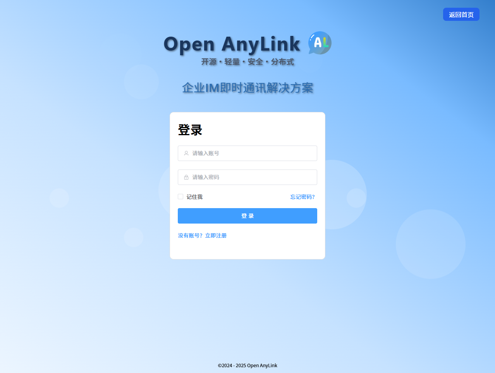

# Open AnyLink 

## 简介

Open AnyLink是一款面向企业的IM即时通讯解决方案，旨在帮助企业`低成本`、`高效率`地构建`私有`、`安全`、`分布式`、`可定制`的日常办公通讯工具。

## 项目演示地址

- https://open-anylink.com/im/login

## 项目构成

| 项目   | 项目名           | 地址                                                                                                                                                                                                                                                                                                                                                                                                                                              | 技术栈                                                                                                                                                                                                                                                                                          |
| ------ | ---------------- | ------------------------------------------------------------------------------------------------------------------------------------------------------------------------------------------------------------------------------------------------------------------------------------------------------------------------------------------------------------------------------------------------------------------------------------------------- | ----------------------------------------------------------------------------------------------------------------------------------------------------------------------------------------------------------------------------------------------------------------------------------------------- |
| Web端  | open-anylink-web | [github](https://github.com/GatlinHa/open-anylink-web)  [gitee](https://gitee.com/lijingbo-2021/open-anylink-web)  | 框架：`Vue3`  构建打包：`Vite`  UI组件：`Element-Plus`                                                                                                                                                                                                                                  |
| 服务端 | open-anylink     | [github](https://github.com/GatlinHa/open-anylink)  [gitee](https://gitee.com/lijingbo-2021/open-anylink)                      | 框架：`spring Boot` `spring cloud` 长连接：`Netty` 私有协议：`protobuf` 配置中心：`Nacos Config` 注册中心：`Nacos Discovery` 关系型数据库：`MySQL` `MyBatis-Plus`(driver) NoSQL数据库：`MongoDB` 缓存：`Redis` 消息队列：`Kafka MQ`  对象存储：`Mino` `OSS` |

- 本项目是其中的`Web端`。

## 版本更新记录

- 2025/3/5: V1.0.0发布，基本功能包括：
  - 单聊、群聊
  - 个人信息、群管理
  - 文本、表情、图片消息
  - 在线消息、离线消息、消息漫游、多端在线、多端同步、已读未读
  - 联系人备注、联系人分组
  - 建群删群、群昵称、群备注、群组组、群头像、群公告、群系统消息、群转让

## 项目功能清单（含规划及开发中）

#### 聊天类型

- [x] 单聊
- [x] 群聊

#### 通话功能

- [ ] 语音通话
- [ ] 视频通话

#### 消息类型

- [x] 文本
- [x] 表情
- [x] 图片
- [ ] 音频
- [ ] 视频
- [ ] 文件

#### 消息功能

- [x] 在线消息
- [x] 离线消息
- [x] 消息漫游
- [x] 多端在线
- [x] 多端同步
- [x] 已读未读
- [ ] 历史消息
- [ ] @消息
- [ ] 消息撤回
- [ ] 消息引用
- [ ] 消息加入待办

#### 群组功能

- [x] 建群删群
- [x] 群昵称
- [x] 群备注
- [x] 群头像
- [x] 群公告
- [x] 群系统消息
- [x] 群转让
- [ ] 万人大群
- [ ] 团队组织群
- [ ] 公开群

#### 通讯录功能

- [x] 联系人备注
- [x] 联系人分组
- [x] 群备注
- [x] 群分组
- [ ] 组织管理

#### 会议功能

- [ ] 语音会议
- [ ] 视频会议
- [ ] 桌面共享
- [ ] 桌面远程操控
- [ ] 会议录制
- [ ] 会议预约

#### AI接入

- [ ] 个人知识库
- [ ] 聊天机器人
- [ ] AI Agent
- [ ] 智慧培训

#### 其他功能

- [ ] 大文件传输
- [ ] 待办事项

## 项目预览

## 项目相关文档

- https://open-anylink.com/docs/

## 开源项目免责声明

1. **项目性质与保证范围**：本 开源项目由本作者开发并在 GitHub 上开源发布，旨在为用户提供面向企业的IM即时通讯解决方案。在法律允许的最大限度内，开发者不对软件的功能性、安全性、适用性作出任何形式的明示或暗示保证，包括但不限于软件无错误、能持续正常运行或完全适配用户特定环境等。
2. **使用风险承担**：用户明确知悉并同意，使用本软件的全部风险由用户自行承担。软件以 “现状” 及 “现有” 基础提供，不存在任何开发者额外承诺的质量保障或性能优化。开发者不提供任何明示或暗示担保，诸如适销性、适合特定用途以及不侵权等方面的担保。
3. **责任限制**：无论基于何种法律理论（包括但不限于合同、侵权、疏忽等），在任何情形下，开发者及其关联方、供应商均不对因使用本软件所引发的任何直接、间接、偶然、特殊、惩罚性或后果性损害负责，包括但不限于利润损失、业务中断、数据丢失、个人信息泄露或其他商业损害、损失。
4. **二次开发与合规责任**：针对基于本项目进行二次开发的用户，需确保将本软件及衍生作品用于合法目的，并自行负责遵循当地法律法规。因二次开发或使用过程中违反法律规定而产生的一切责任、纠纷，均由二次开发者承担，与开发者无关。
5. **项目变更权利**：开发者保留在任何时间对软件功能、特性进行修改的权利，同时有权修订本免责声明的任何部分。此类修改可能通过软件更新、项目文档更新等形式呈现。用户在软件更新或持续使用项目相关内容时，应及时查看并视作接受最新版本的免责声明及软件变更。
6. 请用户仔细阅读并充分理解本免责声明。一旦使用本开源项目，即表明用户已接受本免责声明的全部条款。
7. 该免责声明的最终解释权归开发者所有。

## 交流社群

QQ群号：825505574，微信群有效期：3月17日

## 如何联系我们

- **QQ**：312777916
- **邮箱**：312777916@qq.com
- **微信**：wx_open_anylink_2025（扫下方二维码）

### 最后，如果您觉得还不错，请 `Star`, `Fork`一下本项目，或者“请”作者喝一杯coffee，您的一次小小鼓励将会使我们前进很远很远。

  
  

 
感谢以下赞助者的支持

| 赞助时间 | 赞助者 | 平台 | 金额 |
| -------- | ------ | ---- | ---- |
|          |        |      |
